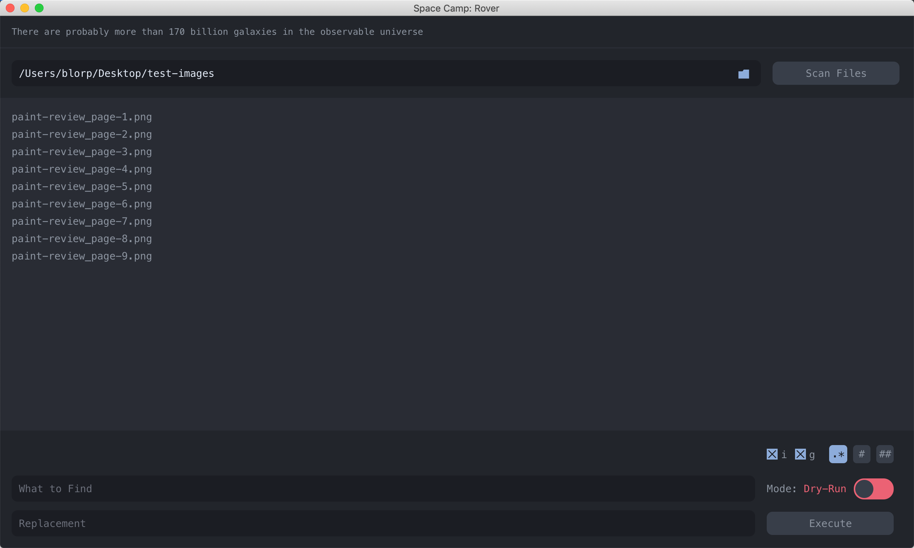
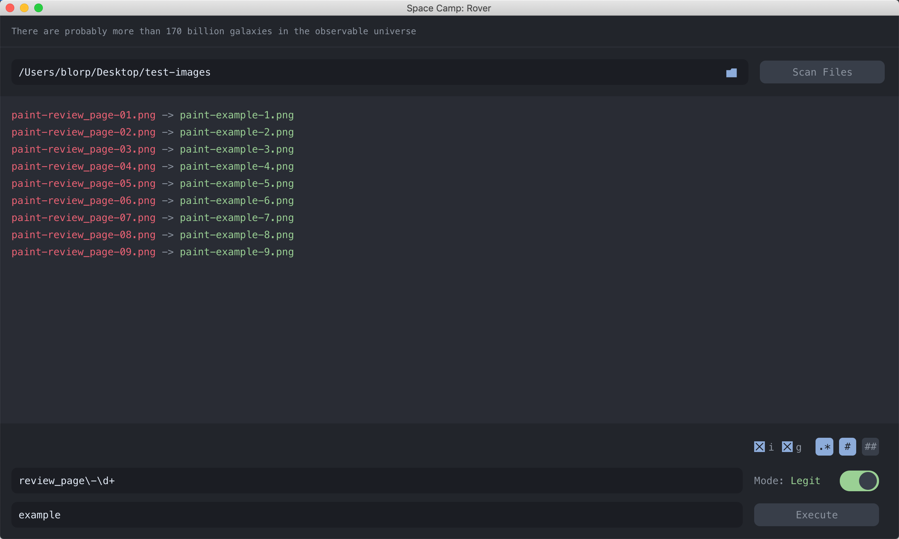
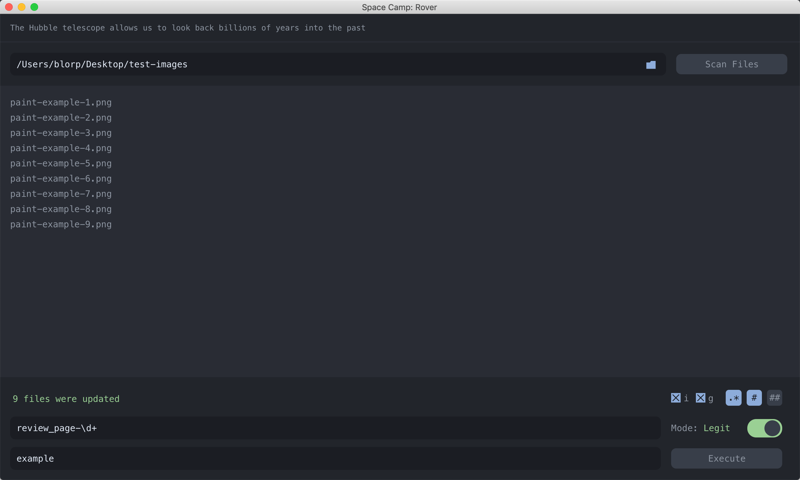

# What is Rover?

Rover is an Electron desktop app that can quickly rename all files in any folder.  It supports exact search/replace, RegEx search/replace and even auto numbers file in single or double digit format. It's a small part of a desktop helper application fleet called Space Camp that will hopefully someday exist.

## License
[MIT](https://choosealicense.com/licenses/mit/)

# Preview

The first step is to select a directory and scan the files. You'll then be presented with a preview of files that can be edited, excluding the  extension.

The second step is to enter your find and replace. In this example we wanted to use RegEx to change "review_page-" and any double digit found in the file names with "example-" and a single digit number. So, the following was done:

1. Select the RegEx option in the bottom right along with "i" and "g"
2. Select the single number sign for ASC single digit numbering
3. Enter your RegEx in the search and enter your replace value. Note that the numbering system is appended to any replace value that you set with the number preceded with a hyphen.
4. Click "Execute" while "Dry Run" is set to see the preview.
5. Toggle "Dry Run" to "Legit" and execute again to have all file names changed accordingly.

You will then be presented with the list of updated files and the total number of files updated

 # Bonus

 In the top of the application it cycles through random space facts!
